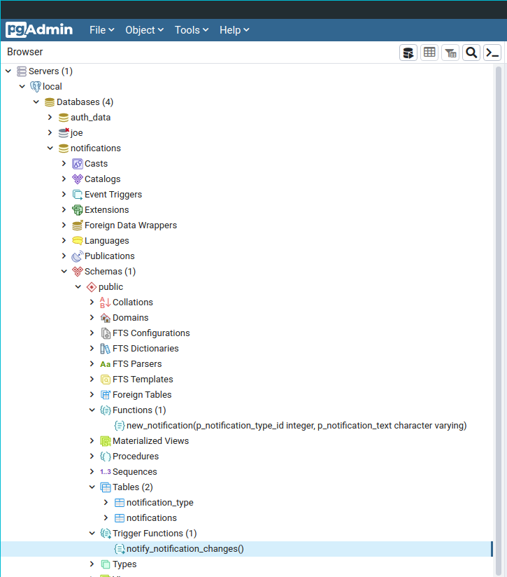

# postgres

[notifications_db_backup.sql](https://github.com/bebo-dot-dev/go-postgres-sockets/blob/main/postgres/notifications_db_backup.sql) is a plain text backup dump of a simple postgresql notifications database

This database was created and tested with "PostgreSQL 13.3 (Ubuntu 13.3-1.pgdg20.04+1) on x86_64-pc-linux-gnu, compiled by gcc (Ubuntu 9.3.0-17ubuntu1~20.04) 9.3.0, 64-bit"

restore the database:
`psql < notifications_db_backup.sql`

## db details

This notifications database contains 2 tables, 1 regular function and 1 trigger function:

### tables:

1. notification_type
2. notifications (has notify_notification_changes() trigger function)

### function:

1. new_notification

### trigger function:

1. notify_notification_changes


## function calls:

```
SELECT public.new_notification(
	1, 
	'notification text data here'
)
```


## pgadmin
